# Segmented Progress Bar

[](https://github.com/rayzone107/SegmentedProgressBar/actions/workflows/ci.yml)
[](https://central.sonatype.com/artifact/io.github.rayzone107/segmentedprogressbar)
[](LICENSE)

An Android progress bar split into a fixed number of equal segments, where **each
segment turns on and off independently**.

Progress here is not a single scalar. Any subset of segments can be on at once, in
any order, which makes the view useful for step indicators, checklist completion,
streak calendars, onboarding flows and anything else that answers "which of these
are done?".

Available as a **View** and as a **Jetpack Compose** Composable, from separate
artifacts that share the same layout maths and the same option types, so the two
render identically.


Every image in this README is rendered by the library itself, from
[`DocsScreenshotTest`](app/src/test/java/com/rachitgoyal/segmentedprogressbar/demo/DocsScreenshotTest.kt),
so none of them can drift away from what the code actually draws.

---

## Contents

- [Install](#install)
- [How to use](#how-to-use)
  - [XML](#xml)
  - [Kotlin](#kotlin)
  - [Java](#java)
  - [Jetpack Compose](#jetpack-compose)
  - [Letting users tap segments](#letting-users-tap-segments)
- [Configuration in detail](#configuration-in-detail)
  - [Segments and selection](#segments-and-selection)
  - [Partial fills](#partial-fills)
  - [Colours](#colours)
  - [Per-division colours](#per-division-colours)
  - [Space between segments](#space-between-segments)
  - [Rounded edges](#rounded-edges)
  - [Segment heights](#segment-heights)
  - [Drop shadow](#drop-shadow)
  - [Size and maximums](#size-and-maximums)
  - [Animation](#animation)
  - [Right to left](#right-to-left)
- [XML attributes](#xml-attributes)
- [API reference](#api-reference)
- [How it renders](#how-it-renders)
- [Accessibility](#accessibility)
- [Requirements](#requirements)
- [Upgrading from 0.0.1](#upgrading-from-001)
- [Building from source](#building-from-source)
- [Contributing](#contributing)
- [License](#license)

---

## Install

On **Maven Central**, so there is no repository to add. Gradle Kotlin DSL:

```kotlin
dependencies {
    // The View. No Compose dependency.
    implementation("io.github.rayzone107:segmentedprogressbar:2.1.0")

    // Optional: the Jetpack Compose bindings.
    implementation("io.github.rayzone107:segmentedprogressbar-compose:2.1.0")
}
```

They are separate artifacts on purpose, so a View-only project never inherits the
Compose runtime. The Compose artifact depends on the View one for the shared
geometry and option types, so taking both never gives you two copies of anything.

Using something other than the Kotlin DSL? Expand whichever applies:

<details>
<summary><b>Gradle (Groovy DSL)</b></summary>
<br>

```groovy
dependencies {
    implementation 'io.github.rayzone107:segmentedprogressbar:2.1.0'
    implementation 'io.github.rayzone107:segmentedprogressbar-compose:2.1.0'
}
```

</details>

<details>
<summary><b>Version catalog</b></summary>
<br>

In `gradle/libs.versions.toml`:

```toml
[versions]
segmentedprogressbar = "2.1.0"

[libraries]
segmentedprogressbar = { module = "io.github.rayzone107:segmentedprogressbar", version.ref = "segmentedprogressbar" }
segmentedprogressbar-compose = { module = "io.github.rayzone107:segmentedprogressbar-compose", version.ref = "segmentedprogressbar" }
```

```kotlin
dependencies {
    implementation(libs.segmentedprogressbar)
    implementation(libs.segmentedprogressbar.compose)
}
```

</details>

<details>
<summary><b>Maven (pom.xml)</b></summary>
<br>

The `aar` type matters; without it Maven looks for a jar that does not exist.

```xml
<dependency>
  <groupId>io.github.rayzone107</groupId>
  <artifactId>segmentedprogressbar</artifactId>
  <version>2.1.0</version>
  <type>aar</type>
</dependency>
```

Worth saying plainly: the Android build tooling is Gradle-only these days, so
this is here for completeness rather than as a route anyone should choose.

</details>

<details>
<summary><b>JitPack</b></summary>
<br>

Versions 2.0.0 and 2.1.0 are on JitPack too, which is where this library was
published before Maven Central. It needs its repository added, in
`settings.gradle.kts`:

```kotlin
dependencyResolutionManagement {
    repositories {
        google()
        mavenCentral()
        maven { url = uri("https://jitpack.io") }
    }
}
```

```kotlin
dependencies {
    implementation("com.github.rayzone107.SegmentedProgressBar:segmentedprogressbar:2.1.0")
    implementation("com.github.rayzone107.SegmentedProgressBar:segmentedprogressbar-compose:2.1.0")
}
```

Mind the group there: `com.github.rayzone107.SegmentedProgressBar`, with a
**dot** before the repository name, not `com.github.rayzone107:`. That is how
JitPack addresses a repository publishing more than one artifact. The shorter
`com.github.rayzone107:segmentedprogressbar` does resolve, by coincidence,
because JitPack reads the artifact id as a repository name and this repository
happens to be called that; there is no repository named
`segmentedprogressbar-compose`, so the Compose artifact resolves only under the
dotted group.

JitPack also builds each tag on first request, so the first resolve after a
release takes a few minutes. Maven Central needs none of these caveats, which is
why it is the recommendation above.

</details>

---

## How to use

The same bar, four ways. Each of these produces the image below:


### XML

```xml
<com.rachitgoyal.segmented.SegmentedProgressBar
    android:id="@+id/progress"
    android:layout_width="match_parent"
    android:layout_height="26dp"
    app:cornerRadius="4dp"
    app:dividerColor="@android:color/transparent"
    app:dividerWidth="3dp"
    app:divisions="10"
    app:progressBarBackgroundColor="#E4E7EB"
    app:progressBarColor="#2F6FED" />
```

Nothing else is required. Add `app:spb_tapToToggle="true"` and the bar is
interactive with no code at all.

### Kotlin

```kotlin
val bar = findViewById<SegmentedProgressBar>(R.id.progress)

bar.divisions = 10

// One assignment sets exactly which segments are on.
bar.enabledDivisions = listOf(1, 2, 5, 6, 9)

// Or work one segment at a time; order does not matter.
bar.enableDivision(4)
bar.disableDivision(9)
bar.toggleDivision(0)
bar.isDivisionEnabled(5)      // true

// Back to empty. Colours, divisions and gaps are preserved.
bar.reset()
```

Building the whole thing in code, with no layout file:

```kotlin
val density = resources.displayMetrics.density

val bar = SegmentedProgressBar(context).apply {
    divisions = 10
    enabledDivisions = listOf(1, 2, 5, 6, 9)
    progressBarColor = Color.parseColor("#2F6FED")
    progressBarBackgroundColor = Color.parseColor("#E4E7EB")
    dividerColor = Color.TRANSPARENT
    dividerWidth = 3 * density
    cornerRadius = 4 * density
}
container.addView(bar, ViewGroup.LayoutParams.MATCH_PARENT, (26 * density).toInt())
```

### Java

The library is Kotlin, with a Java-first surface: `@JvmOverloads` constructors,
getters and setters for every property, and a functional interface for the click
listener, so none of it needs Kotlin syntax to use.

```java
SegmentedProgressBar bar = findViewById(R.id.progress);

bar.setDivisions(10);
bar.setEnabledDivisions(Arrays.asList(1, 2, 5, 6, 9));
bar.toggleDivision(4);

bar.setProgressBarColor(Color.parseColor("#2F6FED"));
bar.setProgressBarBackgroundColor(Color.parseColor("#E4E7EB"));
bar.setDividerWidth(3 * getResources().getDisplayMetrics().density);
bar.setCornerMode(CornerMode.EACH_RUN);

bar.setTapToToggleEnabled(true);
bar.setOnDivisionClickListener((view, index) ->
        label.setText(view.getCompletedSegmentCount() + " of " + view.getDivisions()));

bar.reset();
```

### Jetpack Compose

A real Composable, not an `AndroidView` wrapper: it draws with Compose's own
canvas, so it composes with modifiers, previews, themes and animation the way you
would expect.

```kotlin
var on by remember { mutableStateOf(setOf(1, 2, 5, 6, 9)) }

SegmentedProgressBar(
    divisions = 10,
    enabledSegments = on,
    modifier = Modifier.fillMaxWidth().height(26.dp),
    onColor = Color(0xFF2F6FED),
    offColor = Color(0xFFE4E7EB),
    gap = 3.dp,
    cornerRadius = 4.dp,
    onSegmentClick = { index -> on = if (index in on) on - index else on + index },
)
```

Everything the View supports is a parameter here, using the same option enums
(`CornerMode`, `SegmentAnimation`, `EntryAnimation`, `RecurringAnimation`,
`ShadowTarget`) imported from the base artifact. The names differ in a few places,
because Compose conventions differ:

| | View | Compose |
|---|---|---|
| Segment set | `enabledDivisions: List<Int>`, sorted and de-duplicated for you | `enabledSegments: Set<Int>`, already unordered |
| Space between segments | `dividerWidth` and `dividerColor`, defaulting to a 1px white line | `gap` and `gapColor`, defaulting to a real 2dp gap |
| Heights | `activeHeightRatio`, `inactiveHeightRatio` | `activeHeightFraction`, `inactiveHeightFraction` |
| Durations | `animationDurationMs: Long` | `animationDurationMillis: Int` |
| Sizing | `layout_height`, `spb_maxWidth` | `Modifier` |
| Drop shadow | `shadowRadius` and friends, which force a software layer and confine the blur to the view | a `SegmentShadow`, hardware accelerated, free to overflow the composable |
| Interaction | `spb_tapToToggle`, or a listener, or both | an `onSegmentClick` handler, since the lit set lives outside the bar |
| Partial fills | `setDivisionProgress(index, fraction)` | `segmentProgress: Map<Int, Float>` |
| Per-segment colours | `setDivisionColor(index, color)` | `segmentColors: Map<Int, Color>` |
| Per-segment accessibility | `isPerDivisionAccessibilityEnabled` / `spb_perDivisionAccessibility` | `perSegmentAccessibility` |

### Letting users tap segments

One attribute makes the bar interactive, with no code at all:

```xml
app:spb_tapToToggle="true"
```

or, from code:

```kotlin
bar.isTapToToggleEnabled = true
```

If a tap has to do something else as well, register a listener. It reports which
segment was hit, and runs *after* the bar has toggled it, so it always sees the
state the user is looking at:

```kotlin
bar.setOnDivisionClickListener { view, index ->
    label.text = "${view.completedSegmentCount} of ${view.divisions}"
}
```

A listener on its own reports taps without changing anything, which is what you
want if you hold the lit set yourself:

```kotlin
bar.setOnDivisionClickListener { view, index -> viewModel.onSegmentTapped(index) }
```

Leave `spb_tapToToggle` off in that case, or the bar and your own code will both
toggle and cancel each other out.

To switch touch off entirely, use the platform's own gate, `isClickable = false`
or `android:clickable="false"`; nothing here is dispatched while a view is not
clickable. In Compose there is no separate flag: a bar with an `onSegmentClick` is
interactive and one without it is not.

The view does the coordinate work itself, padding and layout direction included,
and routes taps through `View.performClick`, so it stays accessible. If you need
the raw mapping, `divisionAt(x)` is public too.

> [!NOTE]
> An accessibility service or keyboard activates a view without pointer
> coordinates, so there is no segment to report, and neither the toggle nor the
> listener fires in that case. Pair the bar with a non-positional control; the
> demo app uses a "Clear all" button.

---

## Configuration in detail

Every option, with what it looks like. The demo app's **Playground** tab drives all
of them from live controls if you would rather dial in a look by hand.

### Segments and selection

`divisions` is how many equal segments there are; `enabledDivisions` is which of
them are on. Any subset, in any order.

| Four segments | Twenty-four segments |
|---|---|
| 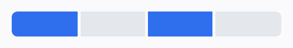 | 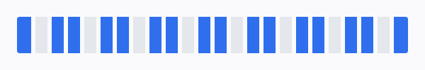 |

| Everything on | Nothing on |
|---|---|
| 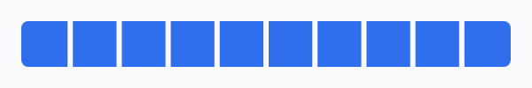 | 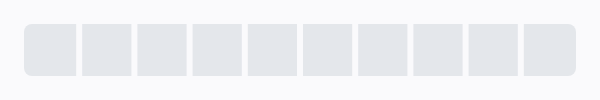 |

```xml
app:divisions="10"
```

```kotlin
bar.divisions = 10
bar.enabledDivisions = listOf(1, 2, 5, 6, 9)
bar.completedSegmentCount        // 5
```

```kotlin
SegmentedProgressBar(divisions = 10, enabledSegments = setOf(1, 2, 5, 6, 9))
```

Out-of-range indices are kept rather than discarded, so the order in which you set
`divisions` and `enabledDivisions` does not matter:

```kotlin
bar.enabledDivisions = listOf(0, 3, 7)
bar.completedSegmentCount               // 1, only index 0 is in range
bar.divisions = 10
bar.completedSegmentCount               // 3, the rest are revealed
```

### Partial fills

Every division has a fill fraction: `1` is exactly `enableDivision`, `0` is
exactly `disableDivision`, and anything between draws the fill over the leading
part of that cell, mirrored under RTL. This is the stories and chapters pattern:
finished segments full, the current one advancing.

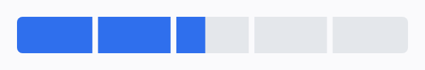

```kotlin
bar.enabledDivisions = listOf(0, 1)   // chapters already read
bar.setDivisionProgress(2, 0.4f)      // 40% through chapter 3
bar.getDivisionProgress(2)            // 0.4f
```

```kotlin
SegmentedProgressBar(
    divisions = 5,
    enabledSegments = setOf(0, 1),
    segmentProgress = mapOf(2 to 0.4f),
)
```

The rules, all deliberate:

- A partial division is **not** enabled: `isDivisionEnabled` reports `false`
  and `completedSegmentCount` does not count it; it joins the lit set only when
  its fraction reaches `1`.
- Any number of divisions can carry a partial at once; each is just a fraction
  by index.
- Every corner mode shapes the fill correctly. Under `CornerMode.EACH_RUN` the
  fill continues the run beside it: the joint is square on both sides and the
  fill's moving edge carries the run's rounded end, so a stories bar reads as
  one pill growing through its cells. The other modes clip the fill to the
  cell's own shape.

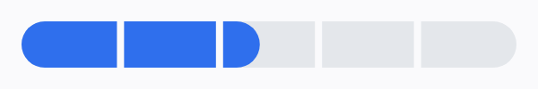
- Changes between partial values apply with no transition, because the callers
  that drive them (playback positions, download progress) update continuously
  and a built-in animation would fight them.
- Reaching `1` hands over to `segmentAnimation` as usual, and a GROW transition
  continues from the partial fill rather than restarting at zero.
- Values are clamped to `0..1`; a NaN throws, since that can only be a bug.

### Colours

Two colours: on and off. There is nothing special about the defaults.

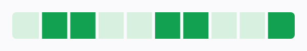

```xml
app:progressBarColor="#12A150"
app:progressBarBackgroundColor="#D7F0E0"
```

```kotlin
bar.progressBarColor = Color.parseColor("#12A150")
bar.progressBarBackgroundColor = Color.parseColor("#D7F0E0")
```

```kotlin
SegmentedProgressBar(
    divisions = 10,
    enabledSegments = on,
    onColor = Color(0xFF12A150),
    offColor = Color(0xFFD7F0E0),
)
```

> [!NOTE]
> `progressBarBackgroundColor` is the colour of the **off segments**, not the
> view's background. `setBackgroundColor` is deprecated here for exactly that
> reason: in 0.0.1 it painted the track, which shadowed `View.setBackgroundColor`
> with a different meaning.

### Per-division colours

One division can have its own on-colour. The rule is one sentence: **a colour
set for a division wins over `progressBarColor` for that division; every
division without one keeps using `progressBarColor`.** Changing the global
colour never clears the overrides, and `clearDivisionColor` or
`clearDivisionColors` is the way back to the single-colour path, which remains
the primary API.

The classic use is a heatmap or streak calendar: every division on, each
carrying an intensity.

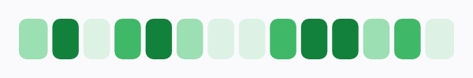

```kotlin
bar.enabledDivisions = (0 until bar.divisions).toList()
intensities.forEachIndexed { index, level ->
    bar.setDivisionColor(index, shadeFor(level))
}

bar.getDivisionColor(3)    // the effective colour: override if set, else global
bar.hasDivisionColor(3)    // whether an override is set
bar.clearDivisionColors()  // back to one colour
```

```kotlin
SegmentedProgressBar(
    divisions = 14,
    enabledSegments = (0 until 14).toSet(),
    segmentColors = intensities.mapIndexed { i, level -> i to shadeFor(level) }.toMap(),
)
```

An override colours everything on-coloured in its division: the full fill, a
partial fill, and the base a shimmer or pulse tints. Off segments always use
`progressBarBackgroundColor`.

### Space between segments

One number, `dividerWidth`, and what it looks like depends on `dividerColor`.

| A real gap, the page showing through | A painted divider line |
|---|---|
| 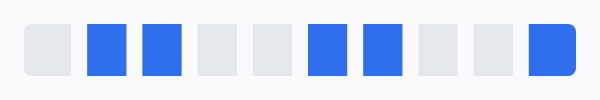 | 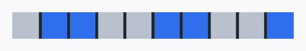 |

| No gap at all |
|---|
|  |

```xml
app:dividerWidth="8dp"
app:dividerColor="@android:color/transparent"
app:isDividerEnabled="true"
```

```kotlin
bar.dividerWidth = 8 * density
bar.dividerColor = Color.TRANSPARENT   // a real gap
bar.dividerColor = Color.WHITE         // a painted divider line
bar.isDividerEnabled = false           // segments run flush into each other
```

```kotlin
SegmentedProgressBar(
    divisions = 10,
    enabledSegments = on,
    gap = 8.dp,
    gapColor = Color.Transparent,      // or a colour, to paint the gap
)
```

The bar is drawn cell by cell rather than as one continuous strip, which is what
makes a transparent divider a genuine gap rather than a window onto the track. An
over-wide value is clamped to one segment, so segments can never collapse.

### Rounded edges

`cornerRadius` sets the radius, and `cornerMode` decides which edges it applies to.
Set the radius to half the height for a pill.

| Mode | Effect | |
|---|---|---|
| `BAR_ENDS` | The default. Only the outer ends of the whole bar; interior edges stay square. | 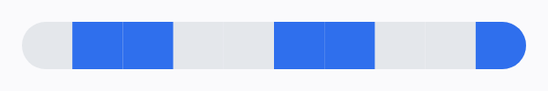 |
| `EACH_SEGMENT` | All four corners of every segment, on or off, so each reads as its own pill. | 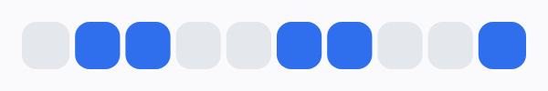 |
| `EACH_RUN` | The outer ends of each *contiguous run* of on segments. Edges touching another on segment stay square, so a run reads as one pill. | 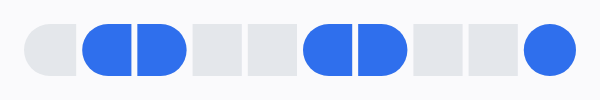 |

```xml
app:cornerRadius="13dp"
app:spb_cornerMode="eachRun"
```

```kotlin
bar.cornerRadius = 13 * density
bar.cornerMode = CornerMode.EACH_RUN
```

```kotlin
SegmentedProgressBar(
    divisions = 10,
    enabledSegments = on,
    cornerRadius = 13.dp,
    cornerMode = CornerMode.EACH_RUN,
)
```

`EACH_RUN` plus a transparent gap is the combination worth trying: a sparse
selection renders as a series of pills whose shapes are defined by the gaps. The
radius is always clamped to half the smaller dimension, so an over-large value
gives a pill rather than an artefact.

### Segment heights

On and off segments have independent heights, as a fraction of the bar. Both
default to the full height, so this costs nothing until you ask for it, and both
bands stay centred on the same axis.

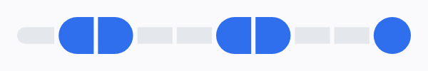

```xml
app:spb_activeHeightRatio="1.0"
app:spb_inactiveHeightRatio="0.45"
```

```kotlin
bar.activeHeightRatio = 1f
bar.inactiveHeightRatio = 0.45f
```

```kotlin
SegmentedProgressBar(
    divisions = 10,
    enabledSegments = on,
    activeHeightFraction = 1f,
    inactiveHeightFraction = 0.45f,
)
```

Either can be the smaller of the two, so on segments can read as raised or as an
inset fill inside a channel. Gaps always span the taller band, so neighbouring
segments stay visually separated.

> [!TIP]
> Pair a large difference with `CornerMode.EACH_RUN`, as above. On its own, a very
> small ratio turns the on segments into disconnected blocks floating over a thin
> rail, which reads as a rendering bug rather than a design.

### Drop shadow

| Cast by every segment | Cast by the on segments only |
|---|---|
| 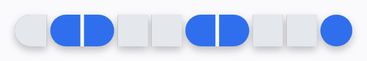 | 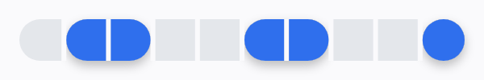 |

```xml
app:spb_shadowRadius="5dp"
app:spb_shadowDy="3dp"
app:spb_shadowColor="#40000000"
app:spb_shadowTarget="all"
android:padding="12dp"
```

```kotlin
bar.shadowRadius = 5 * density
bar.shadowDy = 3 * density
bar.shadowColor = 0x40000000
bar.shadowTarget = ShadowTarget.ALL      // or ON_SEGMENTS, or OFF_SEGMENTS
```

```kotlin
SegmentedProgressBar(
    divisions = 10,
    enabledSegments = on,
    shadow = SegmentShadow(radius = 5.dp, dy = 3.dp, target = ShadowTarget.ALL),
)
```

**A shadow never changes the bar.** It is drawn outside the bar, and enabling one
or changing its blur or offset cannot move or resize anything. The trade-off is
that it needs somewhere to go: **give the view padding**, as in the XML above, or
the blur has nowhere to land. `android:clipChildren="false"` on the parent does not
help, because the bitmap the View renders the shadow into is itself the size of
the view. Compose has no such bitmap and does not clip to a composable's bounds,
so there the shadow simply overflows.

**The bar casts one shadow, shaped like its outline.** Concretely:

- Each segment contributes at most one shadow, so a lit segment is never darker
  than the unlit one beside it.
- Nothing is drawn inside the bar, so a shadow cannot outline a segment or show
  through a translucent one.
- A gap gets shadow only when it is a real opening. Between separate pieces, the
  neighbours' blur spills in exactly as it does beside the bar's outer ends, so
  each piece casts like its own object. A painted divider seals its gaps, the bar
  being one slab there, and so does the slit inside a `CornerMode.EACH_RUN` run,
  where blur falling in would draw the very divider line that mode exists to
  remove.

`shadowTarget` chooses which segments contribute. Because no shadow is ever drawn
inside the bar, `ON_SEGMENTS` shows up along the outside of each lit run, as in the
second image, rather than as a shadow cast onto the track.

One note for the View: Android ignores `Paint` shadow layers on a
hardware-accelerated canvas, so the View renders the shadow once into a cached
bitmap the size of the view and blits it each frame, rebuilding it only when the
bar's silhouette changes. The view itself stays fully hardware accelerated, even
while animating.

For a shadow under the bar *as a whole* with no padding needed, prefer
`android:elevation`. The view supplies a correctly rounded outline, so the
elevation shadow follows the bar's shape rather than its bounding box.

### Size and maximums

Standard layout params work as on any view, plus a maximum, which Android does not
otherwise give a plain `View`:

```xml
android:layout_width="match_parent"
android:layout_height="26dp"
app:spb_maxWidth="420dp"
```

```kotlin
bar.maxWidth = (420 * density).toInt()   // do not stretch across a tablet
bar.maxHeight = SegmentedProgressBar.NO_MAX_SIZE
```

```kotlin
SegmentedProgressBar(
    divisions = 10,
    enabledSegments = on,
    modifier = Modifier.widthIn(max = 420.dp).height(26.dp),
)
```

A minimum wins over a smaller maximum, matching how the framework treats minimums
as the harder constraint. `wrap_content` falls back to an intrinsic 144dp x 8dp
rather than collapsing to nothing.

### Animation

Three independent axes, all off by default so upgrading from 0.0.1 changes
nothing. Static images cannot show these; the demo app's Playground tab can.

**When a segment is toggled**, once the bar is already on screen:

```xml
app:spb_segmentAnimation="fade"
app:spb_animationDuration="320"
```

```kotlin
bar.segmentAnimation = SegmentAnimation.FADE   // or GROW
bar.animationDurationMs = 320
```

`FADE` cross-fades. `GROW` extends from the leading edge, mirrored under RTL so it
always grows in the reading direction. Both animate in *both* directions: turning
a segment off animates it out.

`animationDurationMs` covers this transition and the entry animation below; the
recurring loop has its own `recurringDurationMs`. A duration of `0` means the same
thing as `NONE`: the change happens on the next frame, with nothing in between. A
new duration applies to the next transition, so changing it while the bar is idle
looks like nothing happened.

**When the bar first appears**:

```xml
app:spb_entryAnimation="stagger"
app:spb_entryStaggerDelay="60"
```

```kotlin
bar.entryAnimation = EntryAnimation.STAGGER    // or FADE, GROW
bar.entryStaggerDelayMs = 60
```

`STAGGER` reveals segments one after another, which reads as the bar filling itself
in. Entry is a separate opt-in from `segmentAnimation`, so a bar can animate itself
in without animating every later change. Exactly one of the two is ever in effect
at a time.

**Always, while on screen**:

```xml
app:spb_recurringAnimation="shimmer"
app:spb_recurringDuration="1600"
app:spb_shimmerColor="#73FFFFFF"
```

```kotlin
bar.recurringAnimation = RecurringAnimation.SHIMMER   // or PULSE
bar.recurringDurationMs = 1600
bar.shimmerColor = 0x73FFFFFF
```

In Compose, all three at once:

```kotlin
SegmentedProgressBar(
    divisions = 10,
    enabledSegments = on,
    segmentAnimation = SegmentAnimation.FADE,
    entryAnimation = EntryAnimation.STAGGER,
    recurringAnimation = RecurringAnimation.SHIMMER,
    animationDurationMillis = 320,
    entryStaggerDelayMillis = 60,
    recurringDurationMillis = 1600,
)
```

`SHIMMER` sweeps a highlight across the on segments; `PULSE` breathes them in and
out together. The loop stops on its own while the view is detached or hidden and
resumes when it comes back, so it costs nothing off-screen.

Three deliberate behaviours:

- **The initial state never animates unless you ask.** With `entryAnimation` at
  `NONE`, a screen does not visibly assemble itself when it first appears.
- **The entry animation runs once**, not again on every re-measure or scroll.
- **Interrupted transitions resume from where they got to.** Toggling a segment
  twice in quick succession reverses smoothly instead of snapping.

### Right to left

The view honours `layoutDirection`: under RTL, segment `0` is drawn at the
**right-hand** end of the bar and taps map to the segment actually under the
finger.

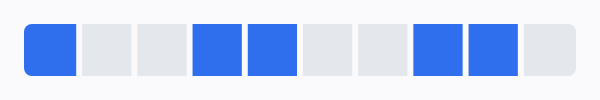

```xml
android:layoutDirection="rtl"
```

Compose follows `LocalLayoutDirection`, so it mirrors with the rest of your UI and
needs nothing set on the bar itself.

> [!IMPORTANT]
> Android gates RTL resolution for *every* view on the application declaring
> `android:supportsRtl="true"` in its manifest. Without it the platform never
> resolves a right-to-left layout direction and this view will draw
> left-to-right no matter what you set.

---

## XML attributes

The original seven:

| Attribute | Format | Default | Description |
|---|---|---|---|
| `divisions` | integer | `1` | Number of equal segments. Must be at least `1`. |
| `progressBarColor` | color | `#5097E2` | Colour of segments that are on. |
| `progressBarBackgroundColor` | color | `#C1C1C1` | Colour of segments that are off. |
| `dividerColor` | color | `#FFFFFF` | Colour painted in the gap. Transparent leaves a real gap. |
| `dividerWidth` | dimension | `1px` | Space between segments. Must not be negative. |
| `isDividerEnabled` | boolean | `true` | Whether that space is applied at all. |
| `cornerRadius` | dimension | `2px` | Corner radius, applied per `spb_cornerMode`. |

Everything added in 2.0.0 is prefixed `spb_`:

| Attribute | Format | Default | Description |
|---|---|---|---|
| `spb_cornerMode` | enum | `barEnds` | `barEnds`, `eachSegment` or `eachRun`. |
| `spb_activeHeightRatio` | float | `1.0` | Height of on segments as a fraction of the bar. |
| `spb_inactiveHeightRatio` | float | `1.0` | Height of off segments as a fraction of the bar. |
| `spb_shadowRadius` | dimension | `0` | Drop-shadow blur. `0` disables it. |
| `spb_shadowDx` / `spb_shadowDy` | dimension | `0` | Drop-shadow offset. |
| `spb_shadowColor` | color | `#40000000` | Drop-shadow colour. |
| `spb_shadowTarget` | enum | `all` | `onSegments`, `offSegments` or `all`. |
| `spb_segmentAnimation` | enum | `none` | Transition when a segment is toggled: `none`, `fade`, `grow`. |
| `spb_animationDuration` | integer | `200` | Duration of that transition, in milliseconds. |
| `spb_entryAnimation` | enum | `none` | How the initial state arrives: `none`, `fade`, `grow`, `stagger`. |
| `spb_entryStaggerDelay` | integer | `60` | Per-segment delay for a staggered entry. |
| `spb_recurringAnimation` | enum | `none` | Continuous animation while visible: `none`, `shimmer`, `pulse`. |
| `spb_recurringDuration` | integer | `1600` | Period of one recurring cycle. |
| `spb_shimmerColor` | color | `#73FFFFFF` | Colour blended in at the peak of a shimmer. |
| `spb_maxWidth` / `spb_maxHeight` | dimension | none | Upper bound on the measured size. |
| `spb_tapToToggle` | boolean | `false` | Whether tapping a segment toggles it. |
| `spb_perDivisionAccessibility` | boolean | `false` | Whether each division is its own accessibility node. |

> [!NOTE]
> The original names are unprefixed for backwards compatibility with 0.0.1
> layouts. Names added since are prefixed because `shadowColor`, `shadowRadius`
> and `cornerMode` are common enough that an unprefixed attribute of the same name
> but a different format in another library would break the resource merge for
> consumers, which is worse than an inconsistent-looking attribute set.

---

## API reference

### Properties

| Property | Type | Notes |
|---|---|---|
| `divisions` | `Int` | Throws `IllegalArgumentException` below `1`. |
| `enabledDivisions` | `List<Int>` | Sorted, de-duplicated copy. Assigning copies the list and drops negatives. |
| `progressBarColor` | `Int` | `@ColorInt`. Segments that are on. |
| `progressBarBackgroundColor` | `Int` | `@ColorInt`. Segments that are off, **not** the view background. |
| `dividerColor` | `Int` | `@ColorInt`. Transparent leaves a real gap. |
| `dividerWidth` | `Float` | Pixels. Throws on negative or non-finite values. |
| `isDividerEnabled` | `Boolean` | |
| `cornerRadius` | `Float` | Pixels. Throws on negative or non-finite values. |
| `cornerMode` | `CornerMode` | `BAR_ENDS`, `EACH_SEGMENT` or `EACH_RUN`. |
| `activeHeightRatio` | `Float` | `0..1`. Height of on segments; throws outside that range. |
| `inactiveHeightRatio` | `Float` | `0..1`. Height of off segments; throws outside that range. |
| `shadowRadius` | `Float` | Pixels. `0` disables the shadow. Throws on negative or non-finite. |
| `shadowDx` / `shadowDy` | `Float` | Pixels. Shadow offset. |
| `shadowColor` | `Int` | `@ColorInt`. |
| `shadowTarget` | `ShadowTarget` | `ON_SEGMENTS`, `OFF_SEGMENTS` or `ALL`. |
| `segmentAnimation` | `SegmentAnimation` | `NONE`, `FADE` or `GROW`. Applies to toggles. |
| `animationDurationMs` | `Long` | Milliseconds. `0` disables animation. Throws on negative. |
| `entryAnimation` | `EntryAnimation` | `NONE`, `FADE`, `GROW` or `STAGGER`. Runs once, on first layout. |
| `entryStaggerDelayMs` | `Long` | Per-segment delay for `STAGGER`. Throws on negative. |
| `recurringAnimation` | `RecurringAnimation` | `NONE`, `SHIMMER` or `PULSE`. Pauses while detached or hidden. |
| `recurringDurationMs` | `Long` | Period of one cycle. Throws if not positive. |
| `shimmerColor` | `Int` | `@ColorInt`. |
| `maxWidth` / `maxHeight` | `Int` | Pixels, or `NO_MAX_SIZE`. A minimum still wins over a smaller maximum. |
| `isTapToToggleEnabled` | `Boolean` | Whether a tap toggles the segment it hit. Sets `isClickable` and `isFocusable`. |
| `isPerDivisionAccessibilityEnabled` | `Boolean` | Whether each division is its own accessibility node. Off by default. |
| `completedSegmentCount` | `Int` | Read-only: how many segments are on *and* in range. |

### Functions

| Function | Description |
|---|---|
| `enableDivision(index)` | Turns one segment on, leaving the others alone. Negative indices ignored. |
| `disableDivision(index)` | Turns one segment off, leaving the others alone. |
| `toggleDivision(index)` | Flips one segment and returns its new state. |
| `isDivisionEnabled(index)` | Whether that segment is on. |
| `setDivisionProgress(index, fraction)` | Fills the leading `fraction` of that segment; `1` enables it, `0` clears it. |
| `getDivisionProgress(index)` | `1` for an enabled segment, the partial fill otherwise, `0` when off. |
| `setDivisionColor(index, color)` | Gives one segment its own on-colour, superseding `progressBarColor` there. |
| `clearDivisionColor(index)` / `clearDivisionColors()` | Back to the single global colour. |
| `getDivisionColor(index)` / `hasDivisionColor(index)` | The effective on-colour, and whether it is an override. |
| `divisionAt(x)` | The segment index at horizontal position `x` (view coordinates, for example `MotionEvent.getX`), or `NO_DIVISION` outside the bar. Handles padding and RTL. |
| `setOnDivisionClickListener(l)` | Reports which segment was tapped, after `isTapToToggleEnabled` has had its say. Sets `isClickable` and `isFocusable`; pass `null` to clear. |
| `reset()` | Turns every segment off. Preserves `divisions`, colours, gaps and corners. |

### Validation policy

The two kinds of bad input are treated differently, on purpose:

- **Invalid configuration**, such as `divisions < 1` or a negative `dividerWidth`,
  `cornerRadius` or `shadowRadius`, throws `IllegalArgumentException`. These can
  only be programming errors, and a bar that silently renders wrong is harder to
  debug than a stack trace. This applies to XML too, so a bad layout fails at
  inflation.
- **Invalid progress data**, meaning indices in `enabledDivisions` outside the
  current division count, is tolerated and simply not drawn, because that list
  usually comes from live application state.

### Instance state

Which segments are on, and the division count, are saved and restored
automatically across configuration changes, provided the view has an
`android:id`.

---

## How it renders

A bar of width `W` with `n` divisions is split into `n` equal cells. Each of the
`n - 1` interior boundaries carries a gap of `dividerWidth`, **centred** on the
boundary, and segments are inset by half a gap on every side that touches an
interior boundary. Segments and gaps therefore tile the bar exactly, with no
overlap:

```
divisions = 3, dividerWidth = d

0            W/3          2W/3           W
|-------------|------------|-------------|
[  segment 0 ]d[ segment 1 ]d[ segment 2 ]
              ^             ^
              gaps, centred on the boundary
```

A few consequences worth knowing:

- The bar is drawn inside the view's **padding**, so padding works as expected.
- `dividerWidth` is clamped to one segment's width, so an over-large value can
  never collapse segments to a negative size.
- With `layout_height="wrap_content"` the view measures to an intrinsic
  144dp x 8dp rather than collapsing to nothing.
- `onDraw` allocates nothing.

The Compose renderer calls the same geometry functions in the same order, from the
same `SegmentGeometry` in the base artifact, which is what keeps the two artifacts
pixel-identical and covered by one set of geometry tests.

---

## Accessibility

By default the bar reports itself to accessibility services as a `ProgressBar`
and, when you have not set a `contentDescription` of your own, supplies a
generated one such as "6 of 10 segments complete", localisable and correctly
pluralised. Setting your own `contentDescription` always wins. That single
summary node is the right experience for a passive progress indicator.

For a bar the user is expected to *operate*, opt in to per-division nodes:

```xml
app:spb_perDivisionAccessibility="true"
```

```kotlin
bar.isPerDivisionAccessibilityEnabled = true
```

```kotlin
SegmentedProgressBar(..., perSegmentAccessibility = true)
```

Each division becomes its own focusable, checkable node ("Segment 3 of 10",
checked or not checked), which a screen reader steps through and, when the bar
is interactive, toggles in place. Activation behaves exactly like a tap: the
division toggles if tap-to-toggle is on, and any listener is notified after. On
an interactive View it also enables keyboard use, arrow keys moving between
divisions and Enter activating one, which is the path taps could never serve
since an accessibility activation carries no coordinates. On a non-interactive
bar the nodes are read-only state.

---

## Requirements

| | |
|---|---|
| **minSdk** | 26 (Android 8.0) |
| **compileSdk** | 37 (Android 17) |
| **Java/Kotlin target** | 17 |
| **Language** | Kotlin, fully usable from Java |
| **View dependencies** | `androidx.annotation`, `androidx.customview` (for the accessibility virtual tree) and `kotlin-stdlib`, nothing else |
| **Compose dependencies** | the above plus Compose foundation and UI |

The View artifact ships no colour resources that could collide with yours,
declares nothing in its manifest, and bundles consumer ProGuard rules so it works
under R8 with no configuration on your side.

---

## Upgrading from 0.0.1

Most code needs no changes. See [docs/MIGRATION.md](docs/MIGRATION.md) for the
full list; the short version:

- **The coordinate changed**, to `io.github.rayzone107:segmentedprogressbar` on
  Maven Central, so no custom repository is needed at all. Worth knowing either
  way: the 0.0.1 README told people to depend on
  `com.github.rayzone107:durationview`, a different library of mine entirely, and
  the tags that did build, `1.00` and `tag_v1`, no longer resolve at all, because
  JitPack cannot build 2018 Gradle any more.
- **`setBackgroundColor(int)` still works** but is deprecated, because it shadows
  `View.setBackgroundColor` with a different meaning. Use
  `setProgressBarBackgroundColor(int)` instead, the method the old README
  documented but which never existed.
- **Invalid configuration now throws** instead of being logged and ignored.
- **`reset()` now actually resets.** In 0.0.1 it cleared the gaps and left the
  selection alone.
- **Several rendering bugs are fixed**, so bars look slightly different. In
  particular gaps now appear on an empty bar, and segments no longer bleed under
  the gap to their right.
- **minSdk moved from 16 to 26** and the library is now AndroidX-only.

---

## Building from source

```bash
git clone https://github.com/rayzone107/SegmentedProgressBar.git
cd SegmentedProgressBar

./gradlew test                  # 329 unit tests across three modules
./gradlew lint                  # must report zero findings
./gradlew :app:installDebug     # the demo app
```

The demo app has two tabs. **Playground** pins a live bar above a scrolling set of
controls for every option, including a colour picker, so you can dial in a look
and read the resulting values off the screen. **Gallery** is a set of worked
examples: a tappable bar, a declarative selection, a weekly habit tracker, gaps
without divider lines, RTL, and each styling option on its own.

Regenerating this README's images after a rendering change:

```bash
./gradlew :app:testDebugUnitTest --tests '*DocsScreenshotTest*' -Pdocs
```

Publishing a release, in full, is [docs/PUBLISHING.md](docs/PUBLISHING.md). The
short version, once a maintainer's machine is set up:

```bash
git tag 2.1.0 && git push origin 2.1.0                          # JitPack
./gradlew publishAndReleaseToMavenCentral --no-configuration-cache   # Maven Central
```

JitPack builds the tag on first request using [`jitpack.yml`](jitpack.yml), and
publishes both artifacts from the one tag. Maven Central is published under
`io.github.rayzone107`, signed, from the same build.

---

## Contributing

Issues and pull requests are welcome. See [CONTRIBUTING.md](CONTRIBUTING.md).

---

## License

```
Copyright 2016-2026 Rachit Goyal

Licensed under the Apache License, Version 2.0 (the "License");
you may not use this file except in compliance with the License.
You may obtain a copy of the License at

    http://www.apache.org/licenses/LICENSE-2.0

Unless required by applicable law or agreed to in writing, software
distributed under the License is distributed on an "AS IS" BASIS,
WITHOUT WARRANTIES OR CONDITIONS OF ANY KIND, either express or implied.
See the License for the specific language governing permissions and
limitations under the License.
```
